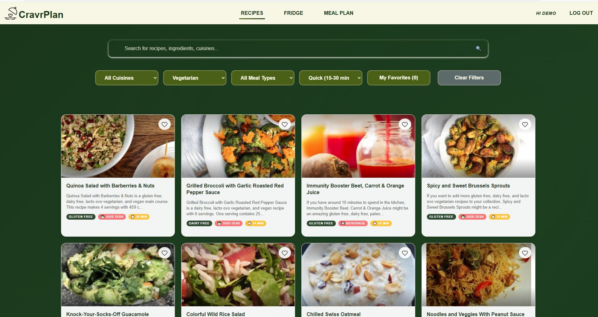
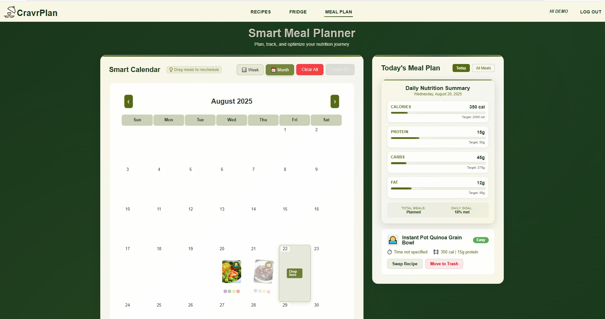
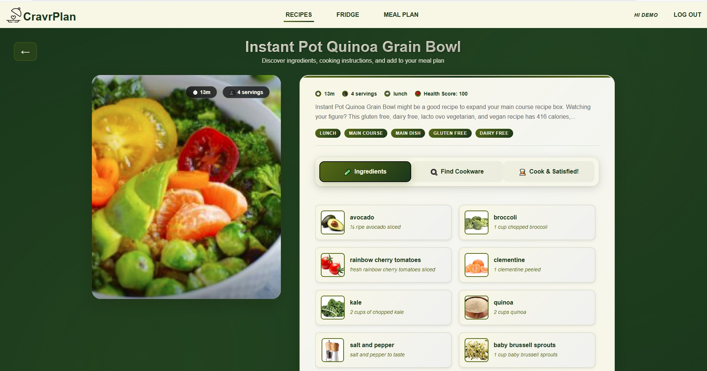

# CravrPlan

<div align="center">


**A sophisticated meal planning platform with intelligent recipe discovery and advanced meal scheduling capabilities.**

[Production Environment](https://cravrplan-app-git-main-emjis-projects-14cc1e9b.vercel.app?_vercel_share=OM1UAqd1kBTuoFXcg05WmgEBXFgklKUr) • [Specification](https://docs.google.com/spreadsheets/d/1g5eVlmOR6unEfcXpWj_1fen46k_u7l35DbiJ_KlgSMg/edit?usp=sharing)  • [Youtube Demo](https://www.youtube.com/watch?v=d0D7ma_L2ns)

</div>

---

## Table of Contents

- [Overview](#overview)
- [Features](#features)
- [Tech Stack](#tech-stack)
- [Quick Start](#quick-start)
- [Deployment (Vercel)](#deployment-vercel)
- [Screenshots](#screenshots)
- [Demo](#demo)
- [Development](#development)
- [Contributing](#contributing)

---

## Overview

CravrPlan is a **production-ready meal planning platform** that demonstrates enterprise-level software engineering practices. Built with modern web technologies, it showcases advanced state management, robust error handling, scalable architecture, and exceptional user experience design.

### Dual User Experience

| Mode | Description | Features |
|------|-------------|----------|
| **Guest Mode** | Try without registration | • Full app exploration except D&D function<br>• Shared localStorage data<br>• No account required |
| **Member Mode** | Personal experience | • Firebase integration<br>• Cross-device sync<br>• Private data isolation |

---

## Features

### Intelligent Recipe Discovery
- **API-First Architecture** with comprehensive fallback systems
- **Advanced Filtering** with 15+ criteria (cuisine, diet, time, nutrition)
- **Real-time Search** with debounced input handling
- **Ingredient-Based Matching** with configurable tolerance
- **Nutritional Analysis** with detailed macro tracking

### Advanced Meal Planning
- **FullCalendar Integration** with drag-and-drop functionality
- **Multi-Meal Support** (breakfast, main course, side dish, dessert, snack)
- **Real-time Synchronization** across devices
- **Optimistic Updates** for smooth user experience
- **Nutritional Statistics** with daily totals

### Enterprise Security
- **Firebase Authentication** with email/password support
- **Comprehensive Security Rules** ensuring data isolation
- **Input Validation & Sanitization** for all user inputs
- **Guest-to-Member Migration** with data preservation

### Performance Optimized
- **Code Splitting** with lazy loading
- **Memoization** for expensive components
- **Bundle Optimization** with Vite
- **Efficient State Management** with React Context

---


---

## Tech Stack

| Category | Technology | Version | Purpose |
|----------|------------|---------|---------|
| **Frontend** | React | 18.3.1 | UI Framework |
| **Language** | TypeScript | 5.8.3 | Type Safety |
| **Build Tool** | Vite | 4.5.14 | Development & Build |
| **Styling** | CSS Modules | - | Scoped Styling |
| **Routing** | React Router DOM | 6.x | Client-side Navigation |
| **State Management** | React Context API | - | Global State |
| **Backend** | Firebase | 10.14.1 | Serverless Backend |
| **Database** | Firestore | - | NoSQL Database |
| **Authentication** | Firebase Auth | - | User Management |
| **External API** | Spoonacular | - | Recipe Data |
| **Calendar** | FullCalendar | - | Meal Planning |
| **Development** | ESLint | - | Code Quality |
| **Hosting** | Vercel | - | Production Deployment |
| **CI/CD** | GitHub Actions | - | Automated Deployment |

---

## Quick Start

### Prerequisites
- Node.js (v16 or higher)
- npm or yarn package manager
- Firebase account (optional - app works with mock data)

### Installation

1. **Clone the repository**
```bash
git clone https://github.com/yourusername/cravrplan-app.git
cd cravrplan-app
```

2. **Install dependencies**
```bash
npm install
```

3. **Environment setup** (required for full functionality)
```bash
# Copy environment template
cp .env.example .env

# Edit .env file and add your actual API keys
# NEVER commit .env to git - it contains sensitive information!
```

**Required Environment Variables:**

| Variable | Description | Source |
|----------|-------------|---------|
| `VITE_FIREBASE_API_KEY` | Firebase Web API Key | [Firebase Console](https://console.firebase.google.com/) |
| `VITE_FIREBASE_AUTH_DOMAIN` | Firebase Auth Domain | Firebase Console → Project Settings |
| `VITE_FIREBASE_PROJECT_ID` | Firebase Project ID | Firebase Console → Project Settings |
| `VITE_FIREBASE_STORAGE_BUCKET` | Firebase Storage Bucket | Firebase Console → Storage |
| `VITE_FIREBASE_MESSAGING_SENDER_ID` | Firebase Sender ID | Firebase Console → Project Settings |
| `VITE_FIREBASE_APP_ID` | Firebase App ID | Firebase Console → Project Settings |
| `VITE_SPOONACULAR_API_KEY` | Spoonacular API Key | [Spoonacular Food API](https://spoonacular.com/food-api) |

**Security Notes:**
- The `.env.example` file contains only placeholder values and is safe to commit
- Your actual `.env` file contains real API keys and should NEVER be committed to git
- The `.gitignore` file is configured to exclude all `.env*` files
- For production deployment, set environment variables in your hosting platform (Vercel, etc.)

4. **Start development server**
```bash
npm run dev
```

5. **Open your browser**
Navigate to `http://localhost:5173`

### Available Scripts

```bash
# Development
npm run dev          # Start development server
npm run build        # Build for production
npm run preview      # Preview production build
npm run lint         # Run ESLint

# Vercel (Deployment)
npm i -g vercel       # Install Vercel CLI (one-time)
vercel link           # Link local project to Vercel (one-time)
vercel                # Deploy a preview build
vercel --prod         # Deploy to production
```

---

### Deployment (Vercel)

1. Install Vercel CLI: `npm i -g vercel`
2. Link the project: `vercel link`
3. Configure build settings (Vercel dashboard or `vercel.json`):
   - Framework Preset: Vite
   - Build Command: `npm run build`
   - Output Directory: `dist`
4. Set environment variables in Vercel (Dashboard → Project → Settings → Environment Variables) and optionally sync locally: `vercel env pull .env.local`
5. Deploy:
   - Preview: `vercel`
   - Production: `vercel --prod`

Note: If you use Firebase Firestore with custom security rules, you may still deploy rules via Firebase CLI:

```bash
firebase deploy --only firestore:rules
```

## Screenshots

<div align="center">

### Home Page - Recipe Discovery

*Main recipe discovery interface with advanced filtering options*

### Meal Planning Calendar

*Interactive calendar with drag-and-drop meal scheduling*

### Recipe Detail View

*Comprehensive recipe information with nutritional data*

### Authentication Flow

*Log in screen demonstrating the authentication entry point*

</div>

---

## Demo
🎥 **[Watch Demo on YouTube](https://youtu.be/d0D7ma_L2ns)**

---

## Development

### Environment Variables

**⚠️ CRITICAL SECURITY INFORMATION ⚠️**

This project uses environment variables to store sensitive API keys and configuration. Follow these steps carefully to ensure your API keys remain secure:

#### 1. Initial Setup
```bash
# Copy the example environment file
cp .env.example .env

# Edit .env with your actual API keys
# NEVER commit this file to git!
```

#### 2. Required Variables
| Variable | Description | Source |
|----------|-------------|---------|
| `VITE_FIREBASE_API_KEY` | Firebase Web API Key | [Firebase Console](https://console.firebase.google.com/) |
| `VITE_FIREBASE_AUTH_DOMAIN` | Firebase Auth Domain | Firebase Console → Project Settings |
| `VITE_FIREBASE_PROJECT_ID` | Firebase Project ID | Firebase Console → Project Settings |
| `VITE_FIREBASE_STORAGE_BUCKET` | Firebase Storage Bucket | Firebase Console → Storage |
| `VITE_FIREBASE_MESSAGING_SENDER_ID` | Firebase Sender ID | Firebase Console → Project Settings |
| `VITE_FIREBASE_APP_ID` | Firebase App ID | Firebase Console → Project Settings |
| `VITE_SPOONACULAR_API_KEY` | Spoonacular API Key | [Spoonacular Food API](https://spoonacular.com/food-api) |

#### 3. Security Best Practices
- ✅ **SAFE TO COMMIT**: `.env.example` (contains only placeholders)
- ❌ **NEVER COMMIT**: `.env` (contains real API keys)
- ✅ **CONFIGURED**: `.gitignore` excludes all `.env*` files
- ✅ **PRODUCTION**: Set environment variables in hosting platform (Vercel, etc.)

#### 4. Why This Matters
- **Firebase API keys** are public by design but should still be protected
- **Spoonacular API keys** are private and can be abused if exposed
- **Domain restrictions** in Firebase console provide additional security
- **Rate limiting** can be bypassed with exposed API keys

### Project Structure
```
src/
├── components/          # Reusable UI components
│   ├── RecipeCard.tsx   # Recipe display component
│   ├── RecipeSearch.tsx # Search and filter interface
│   └── LoadingStates.tsx # Loading and error states
├── context/            # React Context providers
│   ├── AuthContext.tsx # Authentication state
│   ├── FavoritesContext.tsx # User favorites
│   └── PlanContext.tsx # Meal planning state
├── pages/              # Main application pages
│   ├── RecipesPage.tsx # Recipe browsing and search
│   ├── PlanPage.tsx    # Meal planning calendar
│   └── FridgePage.tsx  # Inventory management
├── services/           # External service integrations
│   ├── firebase.ts     # Firebase configuration
│   ├── firestoreService.ts # Firestore operations
│   └── filterService.ts # Recipe filtering logic
├── types/              # TypeScript type definitions
├── utils/              # Utility functions
└── styles/             # Global styles and CSS modules
```


---


---


---


---


---


---

## Contributing

We welcome contributions! Please see our [Contributing Guidelines](CONTRIBUTING.md) for details.

### Development Setup
```bash
# Clone the repository
git clone https://github.com/yourusername/cravrplan-app.git
cd cravrplan-app

# Install dependencies
npm install

# Set up environment variables
cp .env.example .env
# Edit .env with your API keys

# Start development server
npm run dev

# Run linting
npm run lint

# Build for production
npm run build
```

### Contributing Guidelines
1. Fork the repository
2. Create a feature branch (`git checkout -b feature/amazing-feature`)
3. Commit your changes (`git commit -m 'Add amazing feature'`)
4. Push to the branch (`git push origin feature/amazing-feature`)
5. Open a Pull Request

---
